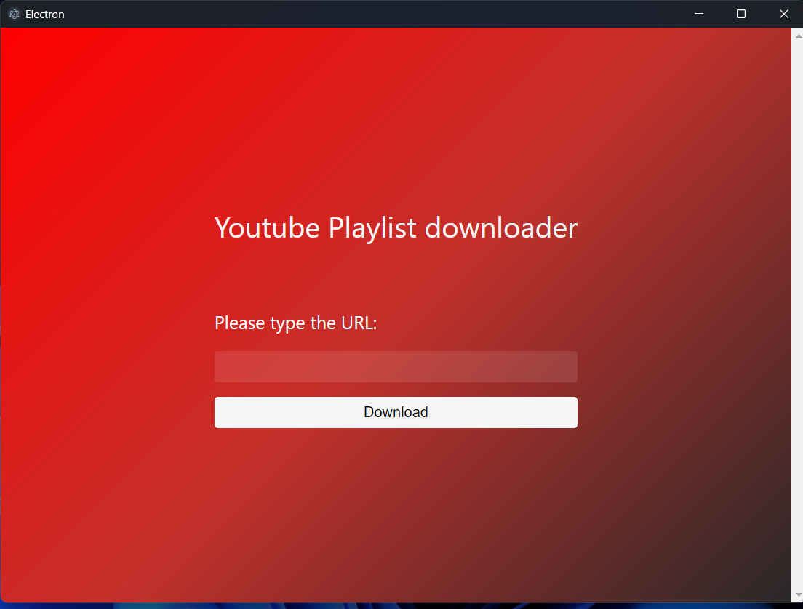
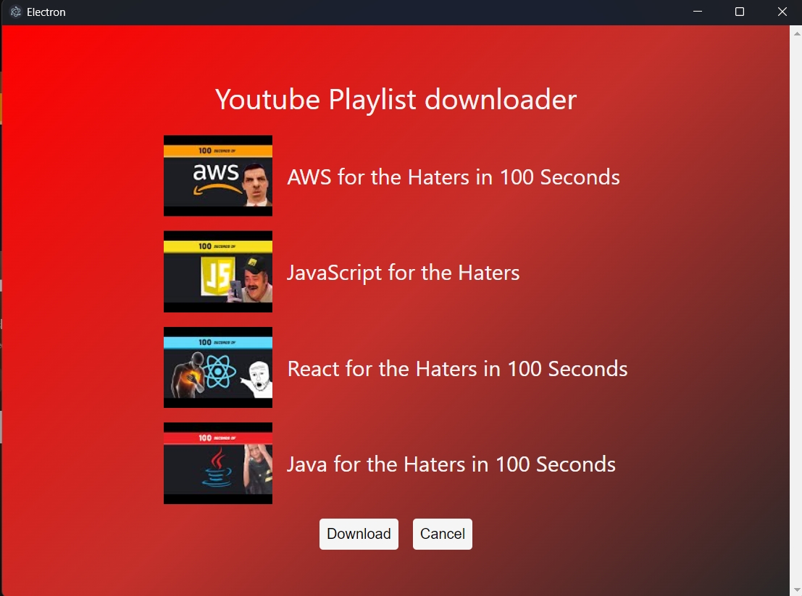
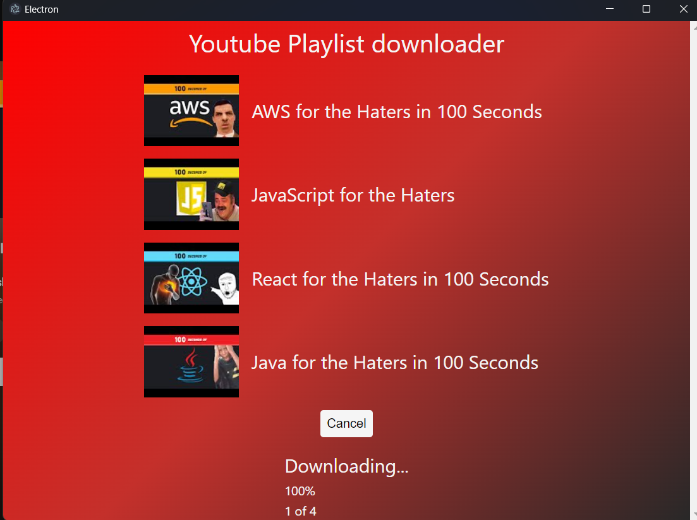
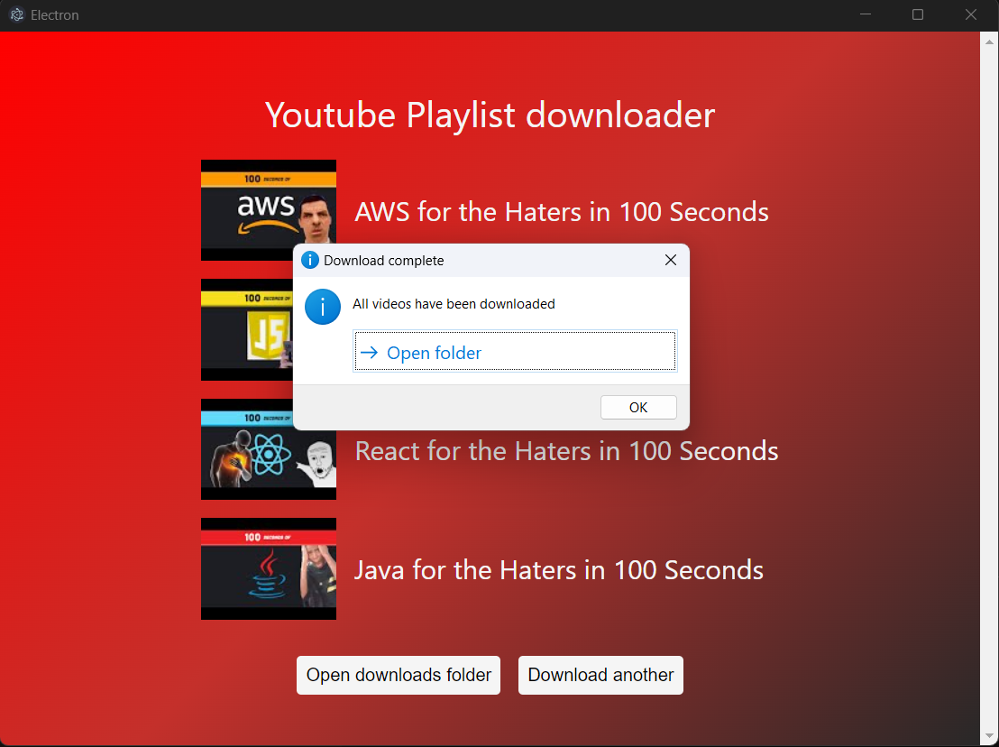

# Youtube Playlist Downloader

An Electron application with React and TypeScript

## Description

This application allows you to download all videos or playlists from youtube.

## Recommended IDE Setup

- [VSCode](https://code.visualstudio.com/) + [ESLint](https://marketplace.visualstudio.com/items?itemName=dbaeumer.vscode-eslint) + [Prettier](https://marketplace.visualstudio.com/items?itemName=esbenp.prettier-vscode)

## Project Setup

### Install

```bash
$ npm install
```

### Development

```bash
$ npm run dev
```

### Build

```bash
# For windows
$ npm run build:win

# For macOS
$ npm run build:mac

# For Linux
$ npm run build:linux
```

## Demo






## Download

- [Windows](https://drive.google.com/drive/folders/16iJ0ItFVnaARihdphxVQ_triMp8iQkLe?usp=sharing)
